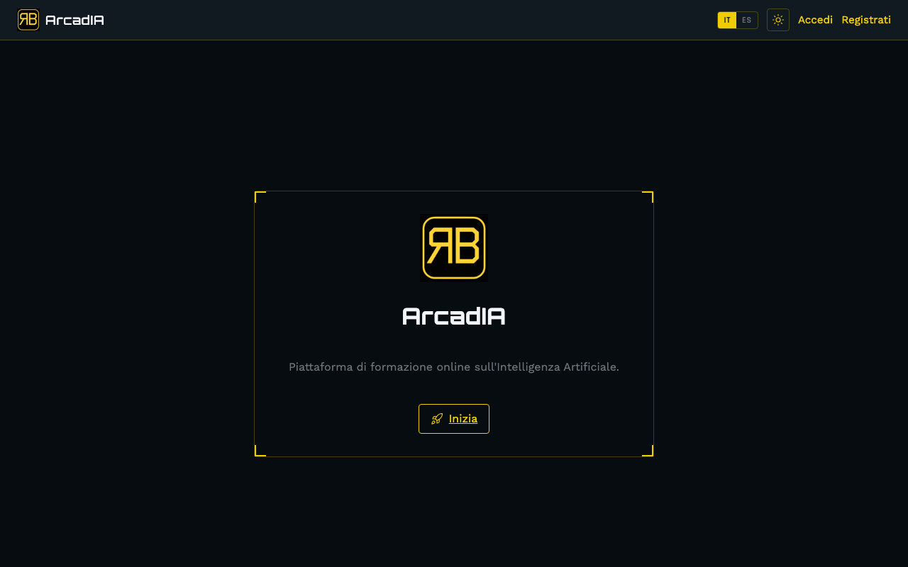

# ArcadIA

Piattaforma di formazione online sull'Intelligenza Artificiale.

**[🔗 Prova la piattaforma → arcadia-jet.vercel.app](https://arcadia-jet.vercel.app)**

---

## Cos'è ArcadIA

ArcadIA è una piattaforma e-learning dove seguire corsi strutturati in lezioni — video, materiale testuale, notebook Jupyter — tracciare il proprio avanzamento, ottenere un certificato di completamento e discutere con gli altri utenti in una bacheca comune.

## Guida rapida

### Registrazione e accesso

Vai su **Registrati** dalla home, inserisci nome, email e una password di almeno 8 caratteri. Al primo accesso riceverai una notifica di benvenuto. Da **Accedi** puoi rientrare in qualsiasi momento con le tue credenziali; la sessione resta attiva per 7 giorni.

### Esplorare i corsi

Dal menu **Corsi** trovi l'elenco di tutti i corsi disponibili, con una barra di ricerca per filtrarli per titolo o descrizione. I corsi con il badge **Premium** richiedono un abbonamento attivo: senza abbonamento se ne vede solo un'anteprima (titolo, descrizione e copertina).

### Seguire una lezione e tracciare l'avanzamento

Ogni corso è composto da lezioni in ordine, ciascuna con un video, una descrizione e — dove presente — un pulsante **Apri in Colab** per eseguire il notebook Jupyter collegato. Segnando le lezioni come completate, la barra di avanzamento del corso si aggiorna automaticamente.

### Certificato di completamento

Al 100% di avanzamento di un corso, compare il pulsante per scaricare il **certificato** in PDF, con il tuo nome, il titolo del corso e la data. Ogni certificato ha un codice di verifica univoco, controllabile pubblicamente anche da chi non ha un account ArcadIA, all'indirizzo `/verify/<codice>`.

### Bacheca e notifiche

Nella sezione **Bacheca** puoi pubblicare messaggi e commentare quelli degli altri utenti. Quando ricevi un commento a un tuo post, o quando viene pubblicato un nuovo corso, ricevi una notifica: il contatore accanto alla campanella nell'header ti avvisa di quelle non ancora lette.

### Lingua e tema

In alto a destra puoi cambiare lingua (italiano/spagnolo) e passare dal tema scuro a quello chiaro in qualsiasi momento. Se sei registrato, la scelta viene salvata sul tuo profilo; da visitatore resta comunque memorizzata nel browser.

### Il tuo profilo

Da **Profilo** puoi modificare nome, bio, avatar, lingua preferita e tema in un unico posto.

### Contenuti premium

I corsi premium restano oggi ad attivazione manuale: l'assegnazione di un abbonamento è gestita da un amministratore. Se vuoi accedere a un corso premium, contatta chi amministra la tua istanza di ArcadIA.

---

## Documentazione tecnica

Per approfondire architettura, stack tecnico, modello dati, sicurezza e deployment, consulta la [relazione tecnica di progetto](docs/capitolato-tecnico.md).

---

## Author

- [@RaffaeleBini](https://www.github.com/RaffaeleBini)

## 🔗 Links

## Feedback

If you have any feedback, please reach out to me
