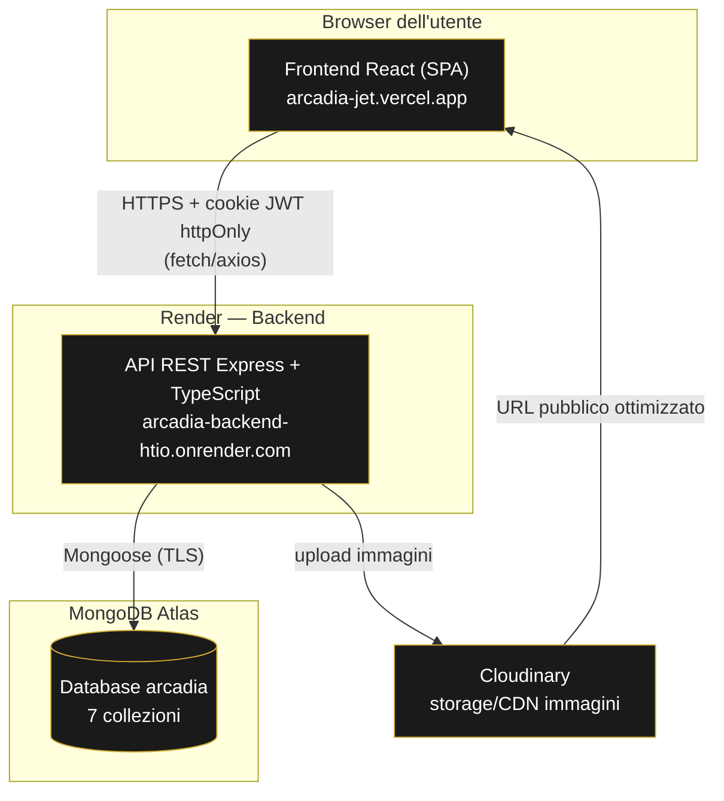
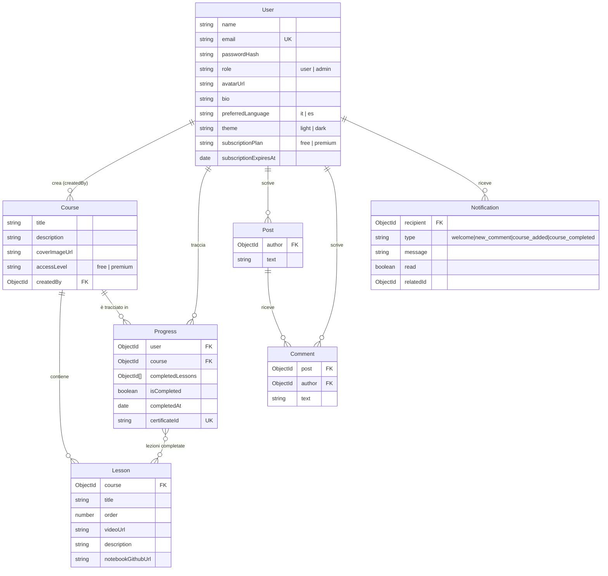

# ArcadIA — Relazione Tecnica di Progetto

**Piattaforma e-learning per la formazione online sull'Intelligenza Artificiale**

| | |
|---|---|
| **Versione documento** | 1.0 |
| **Data** | 15 Agosto 2026 |
| **Stato progetto** | MVP completato e pubblicato in produzione |
| **Ambiente live** | https://arcadia-jet.vercel.app |

---

## Indice

1. [Executive summary](#1-executive-summary)
2. [Obiettivi del progetto](#2-obiettivi-del-progetto)
3. [Metodologia di sviluppo](#3-metodologia-di-sviluppo)
4. [Stack tecnico](#4-stack-tecnico)
5. [Architettura generale](#5-architettura-generale)
6. [Struttura del progetto](#6-struttura-del-progetto)
7. [Modello dati](#7-modello-dati)
8. [API REST](#8-api-rest)
9. [Sicurezza e autenticazione](#9-sicurezza-e-autenticazione)
10. [Funzionalità realizzate](#10-funzionalità-realizzate)
11. [Identità visiva e design system](#11-identità-visiva-e-design-system)
12. [Testing e qualità](#12-testing-e-qualità)
13. [Deployment e infrastruttura di produzione](#13-deployment-e-infrastruttura-di-produzione)
14. [Requisiti non funzionali](#14-requisiti-non-funzionali)
15. [Stato finale e prossimi passi operativi](#15-stato-finale-e-prossimi-passi-operativi)

---

## 1. Executive summary

ArcadIA è una piattaforma e-learning realizzata da zero come MVP (Minimum Viable Product) funzionante, pubblicata e verificata in un ambiente di produzione reale. Permette a un amministratore di pubblicare corsi strutturati in lezioni (video, materiale testuale, notebook Jupyter), e agli utenti registrati di seguirli, tracciare il proprio avanzamento, ottenere un certificato di completamento verificabile pubblicamente e interagire tramite una bacheca comune con notifiche.

Il progetto è stato costruito seguendo un documento di specifiche funzionali e tecniche concordato in partenza, sviluppato in modo incrementale per fasi verificabili, e distribuito su un'infrastruttura cloud gratuita (Vercel, Render, MongoDB Atlas, Cloudinary) pienamente operativa e scalabile in caso di crescita futura.

Questo documento descrive **come** è stato costruito il sistema e **perché** sono state fatte le scelte tecniche e architetturali riportate, così da fornire una base di comprensione e di manutenzione futura indipendente da chi ha sviluppato il progetto.

---

## 2. Obiettivi del progetto

ArcadIA nasce per rispondere a un'esigenza semplice da enunciare ma articolata da realizzare correttamente: **una piattaforma dove pubblicare corsi di formazione sull'IA e seguirne l'avanzamento**, con un'esperienza utente curata e un'identità visiva distintiva (stile "plancia di comando" sci-fi), pronta per un'eventuale evoluzione futura verso un modello di abbonamento a pagamento.

Gli obiettivi funzionali concordati in fase di specifica sono stati:

- Un sistema di autenticazione sicuro, con profili utente personalizzabili.
- Gestione di corsi e lezioni (video, testo, notebook Jupyter) riservata agli amministratori.
- Tracciamento dell'avanzamento di ogni utente per ogni corso, con generazione di certificati di completamento verificabili anche da terzi non registrati.
- Una bacheca comune di discussione, con notifiche relative alle attività rilevanti.
- Multilingua (italiano/spagnolo) e tema chiaro/scuro, entrambi persistenti per l'utente.
- Un'architettura già predisposta per distinguere contenuti gratuiti e "premium", anche se nell'MVP nessun pagamento reale è integrato: l'assegnazione di un abbonamento premium è per ora gestita manualmente da un amministratore, così da poter validare il modello prima di introdurre un sistema di pagamento reale in futuro.

---

## 3. Metodologia di sviluppo

Il progetto è stato sviluppato **a partire da un documento di specifiche** condiviso in anticipo (modelli dati, endpoint API, pagine frontend, requisiti funzionali e non funzionali, checklist di test, piano di deployment), a cui si è affiancato un file di **design token** che definiva in modo vincolante la palette colori, la tipografia e le proporzioni dell'interfaccia. Dove i due documenti divergevano, il file dei design token ha sempre avuto la priorità, garantendo coerenza visiva con l'identità di marca già stabilita.

Lo sviluppo è proceduto per **12 fasi incrementali**, ciascuna corrispondente a un'area funzionale autonoma e verificabile (setup del progetto, autenticazione, profilo utente, internazionalizzazione e tema, corsi e lezioni, avanzamento e certificati, bacheca, notifiche, rifinitura dell'interfaccia, test manuali, deployment). Questo approccio incrementale ha permesso di:

- **Validare ogni funzionalità immediatamente dopo averla costruita**, invece di scoprire eventuali problemi solo alla fine.
- Mantenere ogni fase di lavoro di dimensione gestibile e facilmente revisionabile.
- Produrre una cronologia di commit Git leggibile, dove ogni commit corrisponde a un incremento funzionale compiuto e verificato, utile per la manutenzione futura e per capire l'evoluzione del progetto a posteriori.

All'interno di ogni fase è stato seguito sistematicamente lo stesso ciclo di lavoro:

1. **Implementazione del backend** della funzionalità (modello dati, validazione, logica, endpoint API).
2. **Verifica del backend in isolamento**, tramite richieste dirette alle API (`curl`) contro un database MongoDB temporaneo, prima di scrivere qualunque riga di interfaccia.
3. **Implementazione del frontend** che consuma quelle API.
4. **Verifica visiva e funzionale nel browser**, tramite screenshot automatizzati (desktop e mobile, tema chiaro e scuro) e simulazione dei flussi utente reali (es. registrazione → login → completamento di un corso → download del certificato), incluse verifiche cross-utente con sessioni browser separate dove rilevante (es. un utente commenta il post di un altro, e il primo riceve la notifica corretta).
5. **Controllo dei tipi** end-to-end (`tsc --noEmit`) per intercettare errori strutturali prima ancora dell'esecuzione.
6. **Commit** della fase completata, con messaggio descrittivo del "perché", non solo del "cosa".

Questo metodo — *backend prima, poi verifica, poi frontend, poi verifica di nuovo* — ha ridotto sensibilmente il rischio di costruire interfacce sopra API non ancora corrette, ed è lo stesso approccio con cui, nella Fase 11, è stata eseguita l'intera checklist di 21 test funzionali manuali previsti dalle specifiche (si veda la sezione [12](#12-testing-e-qualità)).

---

## 4. Stack tecnico

Ogni scelta tecnologica ha seguito lo stesso criterio: soluzioni **mature, ampiamente adottate, a costo zero per un MVP**, con una curva di apprendimento contenuta per chi in futuro dovrà mantenere il progetto.

### 4.1 Backend

| Tecnologia | Ruolo | Motivazione |
|---|---|---|
| **Node.js + TypeScript** | Runtime e linguaggio | Tipizzazione statica end-to-end (condivisa concettualmente con il frontend, anch'esso TypeScript), che intercetta in fase di scrittura del codice una classe intera di errori altrimenti scoperti solo a runtime. |
| **Express 5** | Framework web/API | Lo standard de facto per API REST in Node.js: minimale, ben documentato, enorme disponibilità di middleware maturi (usati per CORS, cookie, rate limiting). |
| **MongoDB + Mongoose** | Database e ODM | Modello a documenti adatto a entità con struttura relativamente semplice e gerarchica (corso → lezioni, utente → progressi). Mongoose aggiunge validazione di schema, tipizzazione TypeScript automatica e query più leggibili rispetto al driver nativo. |
| **JWT in cookie httpOnly** | Autenticazione | Sessione stateless (nessuna tabella sessioni da mantenere lato server), ma cookie *httpOnly* per essere illeggibile da JavaScript lato client e quindi non esposto ad attacchi XSS che rubano il token. |
| **bcryptjs** | Hashing password | Standard di settore per la protezione delle password, con costo computazionale calibrabile contro attacchi a forza bruta. |
| **zod** | Validazione input | Schema di validazione dichiarativi, con inferenza automatica dei tipi TypeScript corrispondenti: un'unica fonte di verità sia per la validazione runtime che per i tipi statici. |
| **express-rate-limit** | Protezione endpoint sensibili | Limita i tentativi su login/registrazione per mitigare attacchi a forza bruta o credential stuffing. |
| **multer + Cloudinary** | Upload immagini | Upload in memoria (nessun file temporaneo su disco) e successivo trasferimento diretto a Cloudinary, che si occupa di storage, ridimensionamento e ottimizzazione delle immagini (avatar, copertine corsi). |
| **pdfkit** | Generazione certificati | Generazione di PDF *on-the-fly* lato server, senza dipendere da servizi esterni a pagamento. |

### 4.2 Frontend

| Tecnologia | Ruolo | Motivazione |
|---|---|---|
| **React 19 + TypeScript** | Libreria UI | Ecosistema maturo, ampia disponibilità di sviluppatori per la manutenzione futura, tipizzazione condivisa con il backend. |
| **Vite** | Build tool | Tempi di avvio e ricarica quasi istantanei in sviluppo, build di produzione ottimizzata (code splitting automatico, tree-shaking). |
| **React Router 7** | Routing | Gestione dichiarativa delle rotte, inclusi i pattern di protezione (rotte private, rotte riservate agli admin) implementati come componenti wrapper riutilizzabili. |
| **CSS Modules + variabili CSS custom** | Styling | Stili incapsulati per componente (nessun conflitto globale di classi), con un livello di variabili condivise (colori, spaziature, font) per garantire coerenza visiva senza duplicazione. |
| **react-i18next** | Internazionalizzazione | Libreria standard per applicazioni React multilingua, con caricamento dei testi da file JSON separati per lingua. |
| **lucide-react** | Iconografia | Set di icone *outline* leggere e coerenti stilisticamente con l'estetica "HUD" richiesta. |
| **axios** | Client HTTP | Gestione centralizzata delle richieste API, con invio automatico dei cookie di sessione (`withCredentials`) e normalizzazione degli errori. |

### 4.3 Infrastruttura e servizi esterni

| Servizio | Ruolo | Perché questa scelta |
|---|---|---|
| **Vercel** | Hosting frontend | Deploy automatico ad ogni push su GitHub, CDN globale, piano gratuito sufficiente per un MVP, integrazione nativa con applicazioni Vite/React. |
| **Render** | Hosting backend | Piano gratuito per servizi Node.js con deploy automatico da GitHub, senza necessità di gestire server o container manualmente. |
| **MongoDB Atlas** | Database in cloud | Cluster gestito (M0, piano gratuito), backup e monitoraggio inclusi, nessuna amministrazione di infrastruttura database richiesta. |
| **Cloudinary** | Storage e CDN immagini | Piano gratuito con trasformazioni immagine incluse (ridimensionamento automatico di avatar e copertine), evita di dover gestire storage file autonomamente. |
| **GitHub** | Versionamento e CI/CD implicito | Repository unico (monorepo con cartelle `/frontend` e `/backend`), collegato sia a Vercel che a Render: ogni push sul branch principale aggiorna automaticamente entrambi gli ambienti di produzione. |

---

## 5. Architettura generale

L'applicazione segue un'architettura **client-server disaccoppiata**: un frontend *single-page* (SPA) che comunica esclusivamente tramite API REST con un backend stateless, che a sua volta si appoggia a un database documentale e a due servizi esterni specializzati (storage immagini, nessun servizio di pagamento nell'MVP).



Alcuni principi architetturali seguiti in modo consistente in tutto il backend:

- **Nessuno stato in memoria sul server**: ogni richiesta è autosufficiente (il cookie JWT identifica l'utente), quindi il backend può essere riavviato o scalato orizzontalmente su più istanze senza perdita di sessioni.
- **Un unico punto di controllo degli accessi ai contenuti premium** (`hasAccessToCourse`): la stessa funzione, usata da ogni endpoint che espone contenuti di un corso, decide se un utente ha accesso. Questo evita che la logica di autorizzazione venga duplicata (e potenzialmente resa incoerente) in più punti del codice.
- **Separazione netta tra rappresentazione interna e risposta API**: i modelli del database non vengono mai restituiti direttamente al client. Funzioni dedicate (es. `toPublicUser`) costruiscono esplicitamente la forma dei dati esposta via API, così da non rischiare di esporre per errore campi sensibili (es. l'hash della password) in una risposta.
- **Formato di errore uniforme** su tutte le API (`{ error: true, message, code? }`), che ha permesso al frontend di gestire gli errori in modo generico e coerente su ogni pagina, invece di scrivere logica di gestione errori ad hoc per ogni chiamata.

---

## 6. Struttura del progetto

Il repository è organizzato come **monorepo semplice**, con due cartelle di primo livello indipendenti (ciascuna con il proprio `package.json`, build e deploy):

```
Progetto-ArcadIA/
├── backend/
│   ├── src/
│   │   ├── config/          # connessione MongoDB, configurazione Cloudinary
│   │   ├── controllers/     # logica di business per ogni risorsa
│   │   ├── middleware/      # autenticazione, validazione, rate limit, upload
│   │   ├── models/          # schemi Mongoose (7 collezioni)
│   │   ├── routes/          # definizione degli endpoint REST
│   │   ├── utils/           # funzioni di supporto condivise (JWT, controllo accessi, errori)
│   │   ├── app.ts           # configurazione Express (middleware globali, mount delle routes)
│   │   └── index.ts         # entrypoint: avvio del server
│   └── package.json
│
├── frontend/
│   ├── src/
│   │   ├── api/             # un modulo per risorsa, incapsula le chiamate axios
│   │   ├── components/      # componenti UI riutilizzabili (Header, guardie di rotta, ecc.)
│   │   ├── context/         # stato globale React (autenticazione, preferenze, notifiche)
│   │   ├── i18n/             # configurazione e file di traduzione (it, es)
│   │   ├── pages/            # una pagina per rotta (14 pagine)
│   │   ├── styles/            # design token e stili globali
│   │   ├── types/              # tipi TypeScript condivisi con le forme delle risposte API
│   │   └── App.tsx             # definizione dell'albero di routing
│   └── package.json
│
└── docs/                        # questo documento
```

Questa organizzazione per **responsabilità tecnica** (piuttosto che per feature) è stata scelta perché il progetto, alle dimensioni di un MVP, trae più beneficio dalla prevedibilità ("la validazione è sempre in `middleware/`, i modelli sono sempre in `models/`") che dalla modularità per dominio, che avrebbe introdotto overhead organizzativo non ripagato a questa scala.

---

## 7. Modello dati

Il database è composto da **7 collezioni**, ciascuna corrispondente a un modello Mongoose con schema esplicito e tipizzato. Il diagramma seguente ne rappresenta le relazioni:



Alcune decisioni di modellazione rilevanti:

- **`Progress` come collezione separata** (non annidata dentro `User` o `Course`): un documento per ogni coppia utente/corso, con un **indice univoco composto** su `(user, course)`. Questo garantisce a livello di database — non solo di logica applicativa — che non possano mai esistere due record di avanzamento duplicati per lo stesso utente sullo stesso corso, ed evita di dover caricare in memoria l'intero storico di un utente per leggere il progresso di un singolo corso.
- **`certificateId` come UUID casuale indipendente dall'ID del progresso**: il certificato è verificabile pubblicamente tramite `/verify/:certificateId` senza autenticazione. Usare un identificatore separato (invece dell'`_id` MongoDB del record di progresso) evita di esporre l'ID interno del database nell'URL pubblico del certificato.
- **`subscriptionExpiresAt` nullable sull'utente**: la logica di accesso ai contenuti premium (funzione `hasAccessToCourse`, sezione [5](#5-architettura-generale)) verifica sia il piano (`subscriptionPlan`) sia, se presente, che la data di scadenza non sia già passata. Questo permette all'amministratore di assegnare abbonamenti premium a tempo determinato con una singola operazione, senza bisogno di un job pianificato che "declassi" gli utenti scaduti: il controllo avviene *on demand* ad ogni richiesta.
- **`Notification` con `relatedId` generico**: un unico modello serve tutti e quattro i tipi di notifica previsti (benvenuto, nuovo commento, nuovo corso, corso completato), con `relatedId` che punta al post o al corso pertinente a seconda del tipo. Questo ha evitato di introdurre quattro collezioni separate per un caso d'uso che condivide interamente la stessa logica di lettura/lista/segna-come-letta.

---

## 8. API REST

Tutte le rotte sono montate sotto il prefisso `/api`. Ogni endpoint restituisce JSON; gli errori seguono sempre il formato `{ "error": true, "message": "...", "code"?: "..." }`.

| Risorsa | Endpoint | Metodo | Accesso | Descrizione |
|---|---|---|---|---|
| **Autenticazione** | `/api/auth/register` | POST | Pubblico (rate-limited) | Crea un nuovo account, genera la notifica di benvenuto |
| | `/api/auth/login` | POST | Pubblico (rate-limited) | Verifica le credenziali, imposta il cookie di sessione |
| | `/api/auth/logout` | POST | Autenticato | Cancella il cookie di sessione |
| | `/api/auth/me` | GET | Autenticato | Restituisce il profilo dell'utente corrente |
| **Utenti** | `/api/users/:id` | GET | Autenticato | Profilo pubblico di un utente (nome, avatar, bio) |
| | `/api/users/me` | PUT | Autenticato | Aggiorna il proprio profilo (nome, bio, lingua, tema) |
| | `/api/users/me/avatar` | POST | Autenticato | Carica un nuovo avatar (upload su Cloudinary) |
| **Corsi** | `/api/courses` | GET | Autenticato | Elenco corsi (con ricerca testuale opzionale) |
| | `/api/courses/:id` | GET | Autenticato | Dettaglio corso (anteprima se premium senza accesso) |
| | `/api/courses` | POST | Solo admin | Crea un corso (con copertina opzionale) |
| | `/api/courses/:id` | PUT | Solo admin | Modifica un corso |
| | `/api/courses/:id` | DELETE | Solo admin | Elimina un corso |
| **Lezioni** | `/api/courses/:courseId/lessons` | GET | Autenticato con accesso | Elenco lezioni del corso |
| | `/api/courses/:courseId/lessons/:id` | GET | Autenticato con accesso | Dettaglio lezione |
| | `/api/courses/:courseId/lessons` | POST/PUT/DELETE | Solo admin | Gestione lezioni |
| | `/api/courses/:courseId/lessons/:lessonId/complete` | PUT | Autenticato con accesso | Segna una lezione come completata |
| | `/api/courses/:courseId/lessons/:lessonId/uncomplete` | PUT | Autenticato con accesso | Annulla il completamento |
| **Avanzamento e certificati** | `/api/courses/:courseId/progress` | GET | Autenticato con accesso | Percentuale di avanzamento e stato completamento |
| | `/api/courses/:courseId/certificate` | GET | Autenticato con accesso | Download del certificato PDF (se corso completato al 100%) |
| | `/api/verify/:certificateId` | GET | **Pubblico** | Verifica autenticità di un certificato, senza login |
| **Amministrazione abbonamenti** | `/api/admin/users/:id/subscription` | PUT | Solo admin | Assegna manualmente piano free/premium e scadenza |
| **Bacheca** | `/api/posts` | GET/POST | Autenticato | Elenco e creazione post |
| | `/api/posts/:id` | DELETE | Autenticato (autore o admin) | Eliminazione post |
| | `/api/posts/:id/comments` | GET/POST | Autenticato | Elenco e creazione commenti su un post |
| | `/api/comments/:id` | DELETE | Autenticato (autore o admin) | Eliminazione commento |
| **Notifiche** | `/api/notifications` | GET | Autenticato | Elenco notifiche dell'utente |
| | `/api/notifications/:id/read` | PUT | Autenticato | Segna una notifica come letta |
| | `/api/notifications/read-all` | PUT | Autenticato | Segna tutte le notifiche come lette |
| **Sistema** | `/api/health` | GET | Pubblico | Verifica che il servizio sia attivo (usato anche per il monitoraggio) |

Le rotte delle lezioni sono implementate come **sotto-router annidato** sotto `/api/courses/:courseId/lessons`, tecnica che evita duplicazione di codice nel recupero e controllo di accesso al corso genitore, mantenendo comunque endpoint REST-coerenti e prevedibili.

---

## 9. Sicurezza e autenticazione

La sicurezza è stata affrontata secondo un principio di **difesa a più livelli**, ciascuno indipendente dagli altri:

1. **Password**: mai salvate in chiaro. Hashate con bcrypt (10 round) prima della scrittura su database; l'hash non lascia mai il server (le funzioni di conversione verso le risposte pubbliche, sezione [5](#5-architettura-generale), lo escludono sempre esplicitamente).
2. **Sessione via cookie httpOnly**: il token JWT che identifica l'utente è impostato come cookie con flag `httpOnly` (illeggibile da JavaScript lato client, quindi immune a furto tramite script malevoli/XSS) e `secure` in produzione (trasmesso solo su HTTPS). In produzione l'attributo `SameSite=None` è necessario perché frontend (Vercel) e backend (Render) risiedono su domini diversi; in sviluppo locale si usa `SameSite=Lax`, meno permissivo ma sufficiente perché client e server condividono lo stesso host.
3. **Scadenza della sessione**: ogni token ha validità di 7 giorni, dopo i quali l'utente deve autenticarsi di nuovo.
4. **Validazione rigorosa dell'input**: ogni endpoint che accetta dati in ingresso li valida con uno schema `zod` esplicito *prima* di eseguire qualunque logica; richieste malformate vengono rifiutate con un messaggio d'errore chiaro senza mai raggiungere il livello di business logic o il database.
5. **Controllo dei permessi a due livelli**: `requireAuth` verifica che la richiesta provenga da un utente autenticato; `requireAdmin` (applicato in aggiunta, mai in sostituzione) verifica che quell'utente abbia ruolo amministratore. Gli endpoint di scrittura su corsi e lezioni richiedono sempre entrambi i controlli in sequenza.
6. **Controllo di accesso ai contenuti a pagamento centralizzato**: come descritto in [5](#5-architettura-generale), un'unica funzione (`hasAccessToCourse`) decide se un utente può vedere le lezioni di un corso premium — **anche gli amministratori sono soggetti alla stessa regola**, scelta intenzionale per rispecchiare fedelmente il comportamento che avrà un utente pagante, senza percorsi privilegiati nascosti che potrebbero comportarsi diversamente in produzione rispetto a quanto verificato in test.
7. **Rate limiting su autenticazione**: gli endpoint di login e registrazione sono limitati a 20 richieste per 15 minuti per indirizzo IP, per rendere impraticabili tentativi automatizzati di indovinare le password.
8. **CORS ristretto**: il backend accetta richieste solo dal dominio esplicitamente configurato come frontend autorizzato (variabile d'ambiente `FRONTEND_URL`), non da un'origine qualsiasi.
9. **Upload immagini validati**: solo file PNG/JPEG/WEBP fino a 5 MB sono accettati, verificati sia per estensione che per tipo MIME dichiarato, prima di essere inoltrati a Cloudinary.
10. **Nessun segreto nel codice sorgente**: tutte le credenziali (stringa di connessione al database, chiave segreta JWT, credenziali Cloudinary) sono lette esclusivamente da variabili d'ambiente, mai scritte nel repository. I file `.env` locali sono esclusi dal controllo di versione fin dal primo commit del progetto.

---

## 10. Funzionalità realizzate

### 10.1 Autenticazione e profilo
Registrazione con validazione (email valida, password minimo 8 caratteri), login, logout, sessione persistente. Al primo accesso viene generata automaticamente una notifica di benvenuto. L'utente può modificare in ogni momento nome, biografia, lingua preferita, tema e avatar (con upload immagine); le preferenze di lingua/tema scelte anche **prima della registrazione** (come visitatore) vengono preservate al momento della creazione dell'account, invece di essere sovrascritte dai valori di default.

### 10.2 Corsi e lezioni
Un amministratore può creare, modificare ed eliminare corsi (titolo, descrizione, copertina, livello di accesso free/premium) e le relative lezioni, ciascuna composta da un titolo, un ordine di visualizzazione, un video embeddato (YouTube/Vimeo), una descrizione testuale e/o un link a un notebook Jupyter ospitato su GitHub, per cui l'interfaccia genera automaticamente un pulsante "Apri in Colab" che porta direttamente all'esecuzione del notebook su Google Colab. Gli utenti possono cercare i corsi per titolo/descrizione con una barra di ricerca in tempo reale.

### 10.3 Avanzamento e certificati
Ogni utente può segnare (e annullare) il completamento di singole lezioni; la percentuale di avanzamento del corso viene calcolata automaticamente. Al raggiungimento del 100% viene generato un certificato PDF (nome utente, titolo corso, data, codice di verifica univoco) scaricabile dall'utente, e viene inviata una notifica di corso completato. Il certificato è verificabile pubblicamente tramite un link dedicato (`/verify/:id`), consultabile anche da chi non ha un account — utile ad esempio per un datore di lavoro che voglia confermare l'autenticità di un attestato ricevuto da un candidato.

### 10.4 Contenuti premium (predisposizione)
I corsi possono essere marcati come `premium`: un utente senza abbonamento attivo ne vede solo titolo, descrizione e copertina, con un invito a scoprire i piani, ma non le lezioni. Un amministratore può assegnare manualmente un abbonamento (con scadenza opzionale) a un utente tramite un'operazione dedicata; alla scadenza, l'accesso torna automaticamente in sola anteprima. **Nessun pagamento reale è integrato nell'MVP**: l'architettura è predisposta per innestare in futuro un provider di pagamento (Stripe o simili) senza modificare la logica di autorizzazione già esistente e verificata.

### 10.5 Bacheca e notifiche
Un'area di discussione comune dove ogni utente autenticato può pubblicare post e commentare quelli altrui; ogni post e commento è visibile immediatamente a tutti gli utenti. Chi riceve un commento su un proprio post riceve una notifica; le notifiche (contatore non lette, elenco, segna come letta/tutte come lette) sono aggiornate con un meccanismo di polling automatico ogni 30 secondi e al ritorno di focus sulla finestra del browser, senza necessità di infrastruttura di messaggistica in tempo reale (WebSocket), scelta coerente con la scala di un MVP.

### 10.6 Internazionalizzazione e tema
Interfaccia interamente disponibile in italiano e spagnolo, con cambio lingua immediato (nessun ricaricamento di pagina) e persistente: salvato sul profilo per gli utenti registrati, in memoria locale del browser per i visitatori. Stessa logica per il tema chiaro/scuro (scuro di default, coerente con l'estetica "plancia di comando" del prodotto).

---

## 11. Identità visiva e design system

L'interfaccia adotta uno stile distintivo ispirato ai display HUD ("Heads-Up Display") della fantascienza — plance di comando, non semplici moduli, per rinforzare la sensazione di "pilotare" il proprio percorso di apprendimento.

**Fondamenta del design system:**

- **Palette**: nero/antracite come base, oro come unico colore di accento (nessun secondo colore complementare, per coerenza e per non disperdere l'attenzione visiva), definita in spazio colore **OKLCH** — più uniforme percettivamente rispetto al tradizionale RGB/HEX, così che le variazioni di luminosità tra tema chiaro e scuro restino visivamente equilibrate.
- **Tipografia**: Orbitron per i titoli (squadrato, geometrico, distintamente "tecnologico"), Work Sans per il corpo del testo (alta leggibilità), Rajdhani per etichette e badge (condensato, adatto a elementi compatti dell'interfaccia).
- **Motivo grafico ricorrente**: angoli "a parentesi quadra" (corner brackets) applicati ai pannelli principali dell'interfaccia (moduli di login/registrazione, anteprima corsi premium, verifica certificati), realizzato interamente in CSS puro (senza immagini o markup aggiuntivo), a rinforzo del linguaggio visivo HUD.
- **Variabili di design centralizzate**: colori, spaziature (scala a 8px), raggi di bordo ed effetti *glow* sono definiti una sola volta come variabili CSS globali e riutilizzati ovunque, così che un'eventuale futura modifica del brand richieda di intervenire in un solo punto anziché ricercarla in decine di file.
- **Componenti di stato coerenti**: un componente di caricamento e uno di errore (con azione "Riprova") standard, riutilizzati su tutte le pagine che caricano dati da remoto, così che l'utente non veda mai una pagina bloccata o vuota senza spiegazione in caso di rallentamento o errore di rete.
- **Responsive**: l'interfaccia è stata verificata e adattata sia su viewport desktop che mobile (header con menu compattato sotto i 640px di larghezza).

<div style="page-break-inside: avoid;">

*Home page (tema scuro):*

</div>

---

## 12. Testing e qualità

Oltre alla verifica sistematica eseguita al termine di ogni fase di sviluppo (sezione [3](#3-metodologia-di-sviluppo)), è stata eseguita nella **Fase 11** un'unica sessione di test manuali end-to-end che ha coperto l'intera checklist funzionale concordata nelle specifiche originali — **21 scenari**, tutti verificati con esito positivo:

| Area | Scenari verificati |
|---|---|
| Autenticazione | Registrazione (dati validi ed email duplicata), login (corretto ed errato), logout, redirect automatico da pagine private per utenti non autenticati |
| Profilo | Modifica dati e persistenza dopo refresh della pagina |
| Corsi | Creazione da amministratore, blocco (403) per utenti non amministratori, ricerca testuale |
| Bacheca | Creazione post e commento, notifica generata correttamente e in tempo reale |
| Preferenze | Cambio lingua (propagato a tutta l'interfaccia) e tema (persistente dopo refresh) |
| Avanzamento | Completamento di tutte le lezioni di un corso → barra al 100%, corso segnato completato, notifica ricevuta |
| Certificati | Download PDF con dati corretti (nome, corso, data), verifica pubblica senza login, blocco del download se il corso non è completato al 100% |
| Materiale didattico | Apertura corretta del notebook su Google Colab in una nuova scheda |
| Contenuti premium | Anteprima per utente free, sblocco dopo assegnazione admin, ritorno automatico ad anteprima alla scadenza dell'abbonamento |

La verifica è stata condotta con un mix di chiamate dirette alle API (per la correttezza della logica di business, isolata dall'interfaccia) e automazione del browser (Playwright) per i flussi realmente vissuti dall'utente, incluse verifiche visive tramite screenshot a più risoluzioni e in entrambi i temi.

Ulteriori pratiche di qualità adottate in modo continuativo durante tutto lo sviluppo:

- **Controllo statico dei tipi** (`tsc --noEmit`) eseguito ad ogni fase su entrambi i progetti, per intercettare disallineamenti tra i dati restituiti dal backend e quelli attesi dal frontend prima ancora di eseguire il codice.
- **Verifica della build di produzione** (non solo della modalità di sviluppo) prima del deployment, incluso un avvio reale del server compilato contro il database di produzione.
- **Nessun ambiente di test ha mai usato credenziali o dati reali**: ogni sessione di verifica locale si è appoggiata a un'istanza MongoDB temporanea, creata e distrutta ad ogni sessione, per non rischiare di introdurre dati di prova nell'ambiente reale.

---

## 13. Deployment e infrastruttura di produzione

L'applicazione è distribuita su tre servizi cloud indipendenti, ciascuno responsabile di un solo strato dell'architettura, tutti collegati al medesimo repository GitHub per il deploy automatico continuo:

| Componente | Servizio | URL | Deploy |
|---|---|---|---|
| Frontend (SPA) | Vercel | https://arcadia-jet.vercel.app | Automatico ad ogni push su `main` |
| Backend (API) | Render | https://arcadia-backend-htio.onrender.com | Automatico ad ogni push su `main` |
| Database | MongoDB Atlas | *(cluster privato)* | — |
| Storage immagini | Cloudinary | *(CDN)* | — |

**Configurazione rilevante messa in atto durante il deployment:**

- **Instradamento SPA su Vercel**: è stata aggiunta una regola di *rewrite* (`vercel.json`) che reindirizza qualunque percorso non corrispondente a un file statico verso `index.html`, necessaria perché il routing delle pagine (es. `/courses/123`, `/register`) è gestito interamente lato client da React Router: senza questa regola, l'apertura diretta di un URL diverso dalla home restituiva un errore 404 dal server di hosting.
- **Build in due passaggi sul backend**: Render esegue `npm install && npm run build` (che compila TypeScript in JavaScript nella cartella `dist/`) seguito da `npm start` (che avvia il codice già compilato) — a differenza dell'ambiente di sviluppo, che esegue TypeScript direttamente senza compilazione preventiva, per privilegiare l'iterazione rapida.
- **CORS configurato per dominio incrociato**: essendo frontend e backend su due domini distinti, il backend è configurato per accettare esplicitamente richieste (incluse quelle con invio di cookie) solo dal dominio Vercel di produzione.
- **Variabili d'ambiente** impostate direttamente nei pannelli di controllo di Render e Vercel (mai nel codice sorgente): stringa di connessione MongoDB, chiave segreta JWT generata appositamente per la produzione (diversa da quella usata in sviluppo), credenziali Cloudinary, URL reciproci di frontend e backend.

**Nota operativa sul piano gratuito di Render**: dopo circa 15 minuti di inattività il servizio backend entra in stato di sospensione; la prima richiesta successiva a un periodo di inattività richiede 30-60 secondi per "risvegliare" il servizio, dopodiché torna a rispondere normalmente. È una caratteristica nota del piano gratuito, non un malfunzionamento, ed è risolvibile passando a un piano a pagamento qualora il traffico reale lo giustificasse.

---

## 14. Requisiti non funzionali

| Requisito | Come è stato soddisfatto |
|---|---|
| **Sicurezza** | Vedi sezione [9](#9-sicurezza-e-autenticazione): hashing password, cookie httpOnly, validazione input, controllo permessi, rate limiting, CORS ristretto. |
| **Responsive** | Interfaccia verificata e adattata su viewport desktop e mobile (breakpoint a 640px). |
| **Accessibilità di base** | Attributi `aria-label` sui controlli iconici privi di testo (notifiche, azioni di modifica/eliminazione), struttura semantica HTML (form con `label` associate ai campi). |
| **Manutenibilità** | Codice interamente TypeScript (backend e frontend), struttura a responsabilità separate, formato di errore uniforme, funzioni di accesso ai dati centralizzate, cronologia Git per fasi funzionali leggibili. |
| **Costo dell'infrastruttura** | Interamente su piani gratuiti (Vercel, Render, MongoDB Atlas M0, Cloudinary free tier), nessun costo ricorrente allo stato attuale. |
| **Portabilità futura** | Nessun servizio è vincolante in modo irreversibile: database, hosting e storage immagini sono tutti sostituibili singolarmente (bastano nuove variabili d'ambiente) senza richiedere una riscrittura del codice applicativo. |

---

## 15. Stato finale e prossimi passi operativi

Il progetto è **completo rispetto al perimetro dell'MVP concordato** ed è attualmente **online e pienamente funzionante** in produzione, con tutte le funzionalità descritte in questo documento verificate direttamente sull'ambiente reale (non solo in sviluppo locale).

Punti aperti, non bloccanti per l'utilizzo attuale, da considerare per l'evoluzione successiva:

- **Repository pubblico per i materiali didattici**: i notebook Jupyter (`.ipynb`) dei corsi vanno caricati su un repository GitHub pubblico dedicato, i cui link vengono poi incollati nel pannello di amministrazione di ArcadIA; questo repository non è ancora stato creato, in attesa dei primi contenuti reali da pubblicare.
- **Monetizzazione reale**: come indicato in fase di specifica, l'MVP predispone l'architettura per contenuti premium ma non integra alcun sistema di pagamento reale; l'assegnazione degli abbonamenti resta oggi un'operazione manuale dell'amministratore. L'introduzione di un provider di pagamento reale (es. Stripe) è stata volutamente rimandata a una fase successiva, per validare prima il modello con l'assegnazione manuale.
- **Limite del piano gratuito Render**: da tenere presente nell'uso quotidiano (vedi sezione [13](#13-deployment-e-infrastruttura-di-produzione)); non richiede interventi se il traffico resta contenuto.

Nessun debito tecnico noto è stato lasciato irrisolto all'interno del perimetro funzionale definito dalle specifiche originarie.
